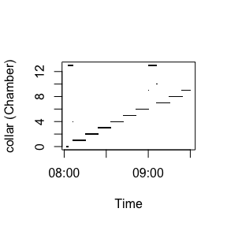
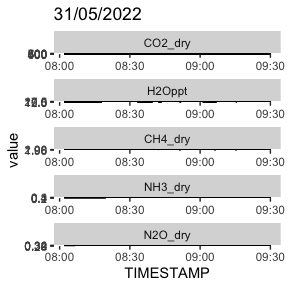
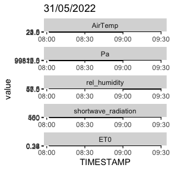
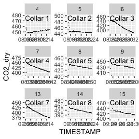
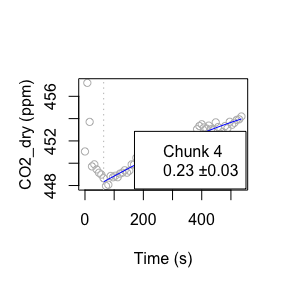
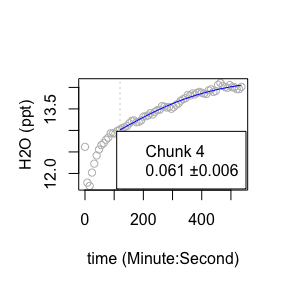
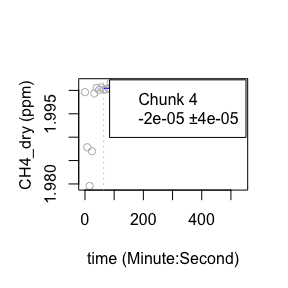
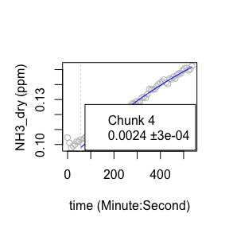
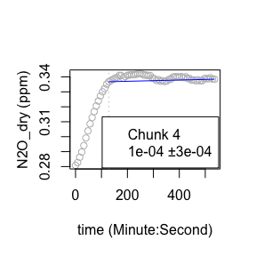

This vignette explains how to use the package ChamberProc for Picarro data. The package largely depends on the package "RespChamberProc" and parts of the vignette are containing information from the "RespChamberProc" vignette.

First, the necessary libraries are loaded:


```
#> Loading required package: zoo
#> 
#> Attaching package: 'zoo'
#> The following objects are masked from 'package:base':
#> 
#>     as.Date, as.Date.numeric
#> Successfully loaded changepoint package version 2.2.4
#>  See NEWS for details of changes.
#> Loading required package: MASS
#> 
#> Attaching package: 'dplyr'
#> The following objects are masked from 'package:plyr':
#> 
#>     arrange, count, desc, failwith, id, mutate, rename, summarise,
#>     summarize
#> The following object is masked from 'package:MASS':
#> 
#>     select
#> The following object is masked from 'package:nlme':
#> 
#>     collapse
#> The following objects are masked from 'package:stats':
#> 
#>     filter, lag
#> The following objects are masked from 'package:base':
#> 
#>     intersect, setdiff, setequal, union
#> 
#> Attaching package: 'purrr'
#> The following object is masked from 'package:plyr':
#> 
#>     compact
#> The following objects are masked from 'package:rlang':
#> 
#>     %@%, flatten, flatten_chr, flatten_dbl, flatten_int, flatten_lgl,
#>     flatten_raw, invoke, splice
#> 
#> Attaching package: 'data.table'
#> The following object is masked from 'package:purrr':
#> 
#>     transpose
#> The following objects are masked from 'package:dplyr':
#> 
#>     between, first, last
#> The following objects are masked from 'package:zoo':
#> 
#>     yearmon, yearqtr
#> The following object is masked from 'package:rlang':
#> 
#>     :=
#> 
#> Attaching package: 'lubridate'
#> The following objects are masked from 'package:data.table':
#> 
#>     hour, isoweek, mday, minute, month, quarter, second, wday, week,
#>     yday, year
#> The following objects are masked from 'package:base':
#> 
#>     date, intersect, setdiff, union
#> Loading required package: foreach
#> 
#> Attaching package: 'foreach'
#> The following objects are masked from 'package:purrr':
#> 
#>     accumulate, when
#> Loading required package: iterators
#> Loading required package: snow
#> Loading required package: future
#> elevatr v0.99.0 NOTE: Version 0.99.0 of 'elevatr' uses 'sf' and 'terra'.  Use 
#> of the 'sp', 'raster', and underlying 'rgdal' packages by 'elevatr' is being 
#> deprecated; however, get_elev_raster continues to return a RasterLayer.  This 
#> will be dropped in future versions, so please plan accordingly.
#> Linking to GEOS 3.11.0, GDAL 3.5.3, PROJ 9.1.0; sf_use_s2() is TRUE
```

# Preparing the chamber data

The user has to set the geographical coordinates of the study site (latitude and longitude) in degrees. Also, the Volue and surface Area of the Chamber need to be defined.


``` r
latDeciDeg <- 37.91514875822371 #enter here latitude in Geographical Coordinates (decimal degrees); crs =4326)
lonDeciDeg <- -4.72405536319233 #enter here longitude in Decimal Degrees

chamberVol = 0.6*0.6*0.6		
surfaceArea = 0.6*0.6
```

The data is loaded. This is a typical data.frame as obtained from a logger file of a PICARRO chamber. Sensor readings from various gases are recorded for sometimes non-equidistant timestamps <1 sec. In the following example, the sample dataset "sample_PICARRO_data" that comes with the "ChamberProc" package is used.

Sometimes, not the entire time series that was loaded is needed, therefore the data can be subset. Columns that are not needed for further calculations should be excluded.


``` r
ds0 <- sample_PICARRO_data


#create timestamp from date and time columns
ds0$TIMESTAMP <- as.POSIXct(paste0(ds0$DATE," ",ds0$TIME), "%Y-%m-%d %H:%M:%S", tz= "UTC")

# Subset data
ds_subset <- subset(ds0, as.numeric(TIMESTAMP) >= as.numeric(RespChamberProc::as.POSIXctUTC("2022-05-31 08:00:00")) )
ds_subset <- subset(ds_subset, as.numeric(TIMESTAMP) <= as.numeric(RespChamberProc::as.POSIXctUTC("2022-05-31 09:30:00" )) )

ds <- ds_subset %>% select(.,-c(DATE,TIME,FRAC_DAYS_SINCE_JAN1,FRAC_HRS_SINCE_JAN1,JULIAN_DAYS,EPOCH_TIME,ALARM_STATUS,INST_STATUS,CHAMBER_TEMP_sync,CHAMBER_PRESSURE_sync,SWITCH_sync,SOIL_TEMP_sync))

head(ds)
#>    solenoid_valves N2O_dry1min  CO2_dry  CH4_dry      H2O      NH3
#>              <num>       <num>    <num>    <num>    <num>    <num>
#> 1:       0.0000000   0.2947989 448.4094 1.992880 1.210567 9.941032
#> 2:       0.9418886   0.2947990 448.4094 1.992749 1.210567 9.941032
#> 3:       0.1404110   0.2928492 448.4095 1.992572 1.210567 9.941392
#> 4:       0.0000000   0.2912658 448.3468 1.992298 1.202615 9.938338
#> 5:       0.0000000   0.2895435 451.0968 1.991855 1.189846 9.933532
#> 6:       0.0000000   0.2883773 453.5823 1.991454 1.178309 9.928979
#>              TIMESTAMP
#>                 <POSc>
#> 1: 2022-05-31 08:01:59
#> 2: 2022-05-31 08:02:01
#> 3: 2022-05-31 08:02:03
#> 4: 2022-05-31 08:02:04
#> 5: 2022-05-31 08:02:06
#> 6: 2022-05-31 08:02:07
```

# Correct Gases

The PICARRO IRGA gives dry mole fractions for CO2, N2O, CH4, but not for NH3 and H2O. Therefore these gases have to be corrected. Additional envrionmental data (h, Pa and AirTemp are crucial) is loaded with the function "Additional_Weather_Data", which downloads meteorological data from the www.open-meteo.com API via the package "openmeteo" and elevation data from the "elevatR" package. The weather data comes in an hourly interval.
Alternatively, values for  and  ,and  can be assigned manually.


``` r

Additional_Weather_Data <- getAdditionalWeatherVariables(latDeciDeg, lonDeciDeg,format(min(ds$TIMESTAMP),"%Y-%m-%d"),format(max(ds$TIMESTAMP),"%Y-%m-%d"))
#> Mosaicing & Projecting
#> Note: Elevation units are in meters
```

``` r

# For the case of PICARRO IRGA gives dry mole fractions for CO2, N2O, CH4, but not for NH3 and H2O
ds$solenoid_valvesInt<-  ds$solenoid_valves %>% as.integer()
ds$H2Oppt <- ds$H2O*10 # H2O from PICARRO is in %.Needs to be in ppt --> We need to multiply by 10
ds$N2O_dry <- ds$N2O_dry1min
ds$NH3_dry <- 10E-3*corrConcDilution(ds, colConc = "NH3", colVapour = "H2Oppt")  #NH3 from PICARRO is in ppb --> multiply colVapour by 10^-3 to get ppm
ds$H2O_dry <- corrConcDilution(ds, colConc = "H2Oppt", colVapour = "H2Oppt")

## (h, Pa, and AirTemp are obtained directly from freely available Meteo and Elevation data for given coordinates during the measurement time interval with the "getElevationAndAtmosphericPressure" script (see details therein). If desired, it can also be set here manually)
# ds$h = 106 # Córdoba elevation (m above sea level)
# ds$Pa <- 101325*(1 - 2.25577*10^-5*h)^5.25588   # (Pa)
# ds$AirTemp <- 25 #(degrees Celsius)

ds <- ds[!duplicated(ds$TIMESTAMP),] # extract duplicated rows

# interpolate measurement timestamps for whole dataset
##create  continuous timestamp vector (here: interval=1 second)
regular_timesteps <- seq(min(ds$TIMESTAMP),max(ds$TIMESTAMP), by="1 sec")

collar_df <- tibble("TIMESTAMP"=ds$TIMESTAMP,"collar"=ds$solenoid_valvesInt)

ds <-convertToRegularTimesteps(ds,c("CO2_dry", "CH4_dry","H2Oppt", "NH3_dry","N2O_dry"),regular_timesteps)
ds <- left_join(ds,collar_df,by=join_by("TIMESTAMP"=="TIMESTAMP")) %>% fill(.,collar,.direction="down")

nrow(ds_subset)
#> [1] 4820
```

``` r
nrow(ds)
#> [1] 5282
```

``` r

#-- In order to process each measurement cycle independently,
#-- we first determine parts of the time series that are contiguous,
#-- i.e. without gaps and without change of an index variable, here variable collar.


ds$TIMESTAMP_hour <- floor_date(ds$TIMESTAMP, unit = "hour") #create a column with a timestamp roundet to the hour, in order to join with hourly evironmental data

#join Temp_PressureData with ds  (approx does not work for more following NA's, just fill nas with same value as last one (function "fill" from tidyr package))
ds <- left_join(ds,Additional_Weather_Data ,by=join_by("TIMESTAMP_hour"=="DATETIME_hourly")) %>% fill(.,h,AirTemp,Pa,rel_humidity,shortwave_radiation,ET0, .direction = "up")

ds$VPD <- calcVPD( ds$AirTemp, ds$Pa, ds$H2Oppt) ## Here we calculate plant-to-air vapour pressure deficit
```

# Data overview

Plots of the whole time series give a good overview about the data.


``` r
p_collar <- plot(ds$TIMESTAMP,ds$collar, pch = ".", ylab = "collar (Chamber)",xlab = "Time")
```

<!-- -->

``` r

### facet plot of time series (for whole subset)
ds_gas_long <- gather(ds, key="gas", value="value", c("CO2_dry","H2Oppt","CH4_dry","NH3_dry","N2O_dry"))
p_gas_facet <- ggplot(ds_gas_long, aes(x=TIMESTAMP, y=value))+
  ggtitle(format(ds$TIMESTAMP,"%d/%m/%Y")[1])+
  geom_point(pch = ".")+
  facet_wrap(~factor(gas,levels=c("CO2_dry","H2Oppt","CH4_dry","NH3_dry","N2O_dry")),ncol=1,scales = "free")

ds_envar_long <- gather(ds, key="envar", value="value", c("AirTemp","Pa","rel_humidity","shortwave_radiation","ET0"))
p_envar_facet <-  ggplot(ds_envar_long, aes(x=TIMESTAMP, y=value))+
  ggtitle(format(ds$TIMESTAMP,"%d/%m/%Y")[1])+
  geom_point(pch = ".")+
  facet_wrap(~factor(envar,levels=c("AirTemp","Pa","rel_humidity","shortwave_radiation","ET0")),ncol=1,scales = "free")

p_collar
#> NULL
```

``` r
p_gas_facet
```

<!-- -->

``` r
p_envar_facet
```

<!-- -->

# Chunk creation
In order to process each measurement cycle independently, we first determine parts of the time series that are contiguous, i.e. without gaps and without change of an index variable, here variable collar. Measurement data can have non-equidistant timesteps. Too many data points may slow down calculations, therefore, data can be thinned. For each collar (chamber), specific settings can be defined in the tibble "collar_spec".


``` r
dsChunk_raw <- subsetContiguous(ds, colTime = "TIMESTAMP", colIndex = "collar",
                            gapLength = 12, minNRec = 180, minTime = 180, indexNA = 13)

# thin data: select the thinning interval to make calculations more efficient
dsChunk <- dsChunk_raw %>% group_by(iChunk) %>% slice(seq(1, n(), 8)) %>% ungroup()

mapped_collars <- dsChunk %>% group_by(iChunk) %>% summarise(collar = first(collar)) %>%  head()

## DataFrame collar_spec then needs to specify for each collar id in column collar,
# the colums area (m2) and volume (m3), as well a tlag (s), the lag time between start of the cycle , i.e. the start of the chunk (usually chamber closing time), and the time when the gas reaches the sensor.

collar_spec <- tibble(
  collar = unique(dsChunk$collar),
  depth = pmax(0,rnorm(length(collar), mean = 0.03, sd = 0.015)),
  area = surfaceArea,
  volume = chamberVol + surfaceArea * depth,
  tlag = NA)
head(collar_spec)
#> # A tibble: 6 × 5
#>   collar  depth  area volume tlag 
#>    <int>  <dbl> <dbl>  <dbl> <lgl>
#> 1      1 0.0344  0.36  0.228 NA   
#> 2      2 0.0167  0.36  0.222 NA   
#> 3      3 0.0223  0.36  0.224 NA   
#> 4      4 0.0563  0.36  0.236 NA   
#> 5      5 0.0116  0.36  0.220 NA   
#> 6      6 0.0214  0.36  0.224 NA
```

# Plots of individual chunks
Time series of individual chunks can be plotted with the function 'chunk_plot()'.


``` r
# Generate labels for each gas
labels_CO2 <- chunk_labels(dsChunk, CO2_dry, 1.05)
labels_H2O <- chunk_labels(dsChunk, H2Oppt, 1.05)
labels_CH4 <- chunk_labels(dsChunk, CH4_dry, 1.05)
labels_N2O <- chunk_labels(dsChunk, N2O_dry, 1.05)
labels_NH3 <- chunk_labels(dsChunk, NH3_dry, 1.05)

# Generate plots for each gas
p_CO2 <- chunk_plot(dsChunk, CO2_dry, labels_CO2)
p_H2O <- chunk_plot(dsChunk, H2Oppt, labels_H2O)
p_CH4 <- chunk_plot(dsChunk, CH4_dry, labels_CH4)
p_N2O <- chunk_plot(dsChunk, N2O_dry, labels_N2O)
p_NH3 <- chunk_plot(dsChunk, NH3_dry, labels_NH3)

##save the plots
# for (p in c("p_CO2","p_H2O","p_CH4","p_N2O","p_NH3")) {
#   ggsave(filename=paste0(results_dir,"/",str_sub(fileName,end=-18),"_allchunks_",p,".pdf"),get(p),width = 40,height = 30,units = "cm")
# }

p_CO2
```

<!-- -->

# Calculation of the gas fluxes

``` r
# Determine fits for selected chunks and compute the flux --------------------------------------

##select just one chunk
selected_chunk=4
df<-filter(dsChunk,iChunk==selected_chunk)


resFit <- calcClosedChamberFlux(df
                                , fRegress = c(lin = regressFluxLinear, tanh = regressFluxTanh, exp = regressFluxExp, poly= regressFluxSquare)
                                , debugInfo = list(omitEstimateLeverage = FALSE)	# faster
                                , colConc = "CO2_dry", colTime = "TIMESTAMP"	# colum names conc ~ timeInSeconds
                                , colTemp = "AirTemp", colPressure = "Pa"		#Temp in degC, Pressure in Pa
                                , volume = 0.4*0.4*0.4, area = 0.4*0.4
                                , minTLag = 60,  maxLag = 120
                                , concSensitivity = 0.01
)


resH2OFit <- calcClosedChamberFlux(df
                                   , fRegress = c(lin = regressFluxLinear, tanh = regressFluxTanh, exp = regressFluxExp, poly= regressFluxSquare)
                                   , debugInfo = list(omitEstimateLeverage = FALSE)	# faster
                                   , colConc = "H2Oppt", colTime = "TIMESTAMP"
                                   , colTemp = "AirTemp", colPressure = "Pa"
                                   , volume = 0.4*0.4*0.4, area = 0.4*0.4
                                   , minTLag = 120,  maxLag = 150,
                                   , concSensitivity = 0.01
)


resCH4Fit <- calcClosedChamberFlux(df
                                   , fRegress = c(lin = regressFluxLinear, tanh = regressFluxTanh, exp = regressFluxExp, poly= regressFluxSquare)
                                   , debugInfo = list(omitEstimateLeverage = FALSE)	# faster
                                   , colConc = "CH4_dry", colTime = "TIMESTAMP"
                                   , colTemp = "AirTemp", colPressure = "Pa"
                                   , volume = 0.4*0.4*0.4, area = 0.4*0.4
                                   , minTLag = 50,  maxLag = 150
                                   , concSensitivity = 0.01
)


resNH3Fit <- calcClosedChamberFlux(df
                                   , fRegress = c(lin = regressFluxLinear, tanh = regressFluxTanh, exp = regressFluxExp, poly= regressFluxSquare)
                                   , debugInfo = list(omitEstimateLeverage = FALSE)	# faster
                                   , colConc = "NH3_dry", colTime = "TIMESTAMP"
                                   , colTemp = "AirTemp", colPressure = "Pa"
                                   , volume = 0.4*0.4*0.4, area = 0.4*0.4
                                   , minTLag = 50,  maxLag = 120
                                   , concSensitivity = 0.01
)


resN2OFit <- calcClosedChamberFlux(df
                                   , fRegress = c(lin = regressFluxLinear, tanh = regressFluxTanh, exp = regressFluxExp, poly= regressFluxSquare)
                                   , debugInfo = list(omitEstimateLeverage = FALSE)	# faster
                                   , colConc = "N2O_dry", colTime = "TIMESTAMP"
                                   , colTemp = "AirTemp", colPressure = "Pa"
                                   , volume = 0.4*0.4*0.4, area = 0.4*0.4
                                   , minTLag = 120,  maxLag = 180
                                   , concSensitivity = 0.01
)
```

# Inspection of the results
The results can be inspected:
Its a one-row tibble with fitting statistics and fitted model objects. While all the first columns are numeric, column times holds a vector of times after lag-phase for which concentration predictions have been made by the model object given in column model (see explanations on the graph below).

The most important information are the estimate of the flux, and its uncertainty, both in unit mumol/m2/s:


``` r
resFit[,c("flux","sdFlux")]
#> # A tibble: 1 × 2
#>    flux sdFlux
#>   <dbl>  <dbl>
#> 1 0.231 0.0261
```

Or in gC/m2/day:


``` r
fluxInMuMol <- unlist(resFit[,c("flux","sdFlux")])
convert_mumolPers_to_gPerday(fluxInMuMol)
#>       flux     sdFlux 
#> 0.23924559 0.02711762
```


# Visualisation of the results
The results can be visualized in a plot:

``` r
## plot the fits
plotResp(df, resFit, label = paste("Chunk",selected_chunk,sep = " "))
```

<!-- -->

``` r

plotResp(df, resH2OFit,colConc = "H2Oppt",ylab="H2O (ppt)",xlab="time (Minute:Second)", label = paste("Chunk",selected_chunk,sep = " "))
```

<!-- -->

``` r

plotResp(df, resCH4Fit,colConc = "CH4_dry",ylab="CH4_dry (ppm)",xlab="time (Minute:Second)", label = paste("Chunk",selected_chunk,sep = " "))
```

<!-- -->

``` r

plotResp(df, resNH3Fit,colConc = "NH3_dry",ylab="NH3_dry (ppm)",xlab="time (Minute:Second)", label = paste("Chunk",selected_chunk,sep = " "))
```

<!-- -->

``` r

plotResp(df, resN2OFit,colConc = "N2O_dry",ylab="N2O_dry (ppm)",xlab="time (Minute:Second)", label = paste("Chunk",selected_chunk,sep = " "))
```

<!-- -->

The fitted form (solid line) approximates the change of measured concentration (points) over time. Usually there is a lag-time (dotted vertical line) between concentration change, and when the time when the signal reaches the sensor. The flux after the intial lag-time is reported at the top left together with its uncertainty in mumol/m2/s. The label can be provided to distinguish different measurement cycles.


# Duration uncertainty

