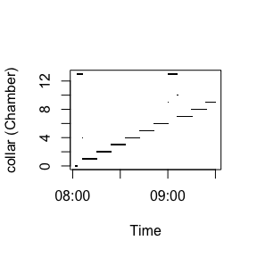
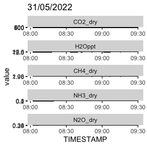
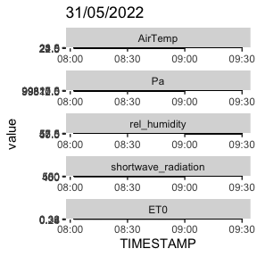
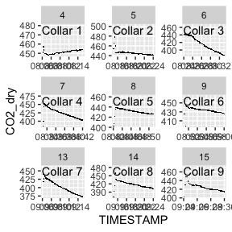
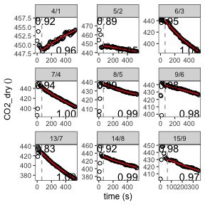
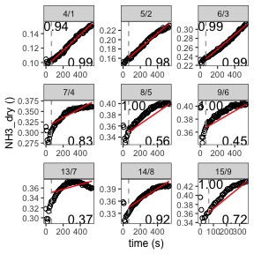
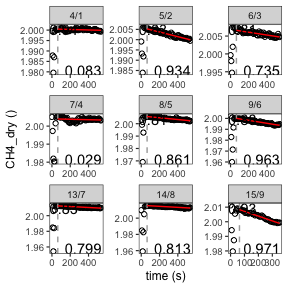
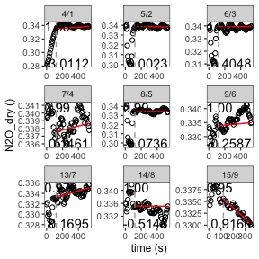
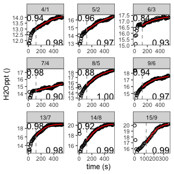

This vignette explains how to use the package ChamberProc for Picarro data. The package largely depends on the package "RespChamberProc" and parts of the vignette are containing information from the "RespChamberProc" vignette.

First, the necessary libraries are loaded:


``` r
# load libraries
library(ChamberProc)
library(RespChamberProc)
library(rlang)
library(changepoint)
library(nlme)
library(segmented)
library(tibble)
library(plyr)
library(dplyr)
library(purrr)
library(stringr)
library(ggplot2)
library(data.table)
library(lubridate)
library(tidyr)
library(doSNOW)
library(furrr)
library(elevatr)
library(sf)
library(openmeteo) #retrieves historical weather data from https://open-meteo.com/en/docs/historical-weather-api
```

# Preparing the chamber data

The user has to set the geographical coordinates of the study site (latitude and longitude) in degrees. Also, the Volue and surface Area of the Chamber need to be defined.


``` r
latDeciDeg <- 37.91514875822371 #enter here latitude in Geographical Coordinates (decimal degrees); crs =4326)
lonDeciDeg <- -4.72405536319233 #enter here longitude in Decimal Degrees

chamberVol = 0.6*0.6*0.6		
surfaceArea = 0.6*0.6

#path to results folder
dir.create("results")
#> Warning in dir.create("results"): 'results' already exists
```

``` r
results_dir <- "results/"
  
```

The data is loaded. This is a typical data.frame as obtained from a logger file of a PICARRO chamber. Sensor readings from various gases are recorded for sometimes non-equidistant timestamps <1 sec. In the following example, the sample dataset "sample_PICARRO_data" that comes with the "ChamberProc" package is used.

Sometimes, not the entire time series that was loaded is needed, therefore the data can be subset. Columns that are not needed for further calculations should be excluded.


``` r
ds0 <- sample_PICARRO_data

#create timestamp from date and time columns
ds0$TIMESTAMP <- as.POSIXct(paste0(ds0$DATE," ",ds0$TIME), "%Y-%m-%d %H:%M:%S", tz= "UTC")

# Subset data
ds_subset <- subset(ds0, as.numeric(TIMESTAMP) >= as.numeric(RespChamberProc::as.POSIXctUTC("2022-05-31 08:00:00")) )
ds_subset <- subset(ds_subset, as.numeric(TIMESTAMP) <= as.numeric(RespChamberProc::as.POSIXctUTC("2022-05-31 09:30:00" )) )

ds <- ds_subset %>% select(.,-c(DATE,TIME,FRAC_DAYS_SINCE_JAN1,FRAC_HRS_SINCE_JAN1,JULIAN_DAYS,EPOCH_TIME,ALARM_STATUS,INST_STATUS,CHAMBER_TEMP_sync,CHAMBER_PRESSURE_sync,SWITCH_sync,SOIL_TEMP_sync))

head(ds)
#>    solenoid_valves N2O_dry1min  CO2_dry  CH4_dry      H2O      NH3
#>              <num>       <num>    <num>    <num>    <num>    <num>
#> 1:       0.0000000   0.2947989 448.4094 1.992880 1.210567 9.941032
#> 2:       0.9418886   0.2947990 448.4094 1.992749 1.210567 9.941032
#> 3:       0.1404110   0.2928492 448.4095 1.992572 1.210567 9.941392
#> 4:       0.0000000   0.2912658 448.3468 1.992298 1.202615 9.938338
#> 5:       0.0000000   0.2895435 451.0968 1.991855 1.189846 9.933532
#> 6:       0.0000000   0.2883773 453.5823 1.991454 1.178309 9.928979
#>              TIMESTAMP
#>                 <POSc>
#> 1: 2022-05-31 08:01:59
#> 2: 2022-05-31 08:02:01
#> 3: 2022-05-31 08:02:03
#> 4: 2022-05-31 08:02:04
#> 5: 2022-05-31 08:02:06
#> 6: 2022-05-31 08:02:07
```

# Correct Gases

The PICARRO IRGA gives dry mole fractions for CO2, N2O, CH4, but not for NH3 and H2O. Therefore these gases have to be corrected. Additional envrionmental data (h, Pa and AirTemp are crucial) is loaded with the function "Additional_Weather_Data", which downloads meteorological data from the www.open-meteo.com API via the package "openmeteo" and elevation data from the "elevatR" package. The weather data comes in an hourly interval.
Alternatively, values for the elevation *h*,  *AirTemp*, and Surface Pressure *Pa* can be assigned manually.


``` r

Additional_Weather_Data <- getAdditionalWeatherVariables(latDeciDeg, lonDeciDeg,format(min(ds$TIMESTAMP),"%Y-%m-%d"),format(max(ds$TIMESTAMP),"%Y-%m-%d"))

# For the case of PICARRO IRGA gives dry mole fractions for CO2, N2O, CH4, but not for NH3 and H2O
ds$solenoid_valvesInt<-  ds$solenoid_valves %>% as.integer()
ds$H2Oppt <- ds$H2O*10 # H2O from PICARRO is in %.Needs to be in ppt --> We need to multiply by 10
ds$N2O_dry <- ds$N2O_dry1min
ds$NH3_dry <- 10E-3*corrConcDilution(ds, colConc = "NH3", colVapour = "H2Oppt")  #NH3 from PICARRO is in ppb --> multiply colVapour by 10^-3 to get ppm
ds$H2O_dry <- corrConcDilution(ds, colConc = "H2Oppt", colVapour = "H2Oppt")

## (h, Pa, and AirTemp are obtained directly from freely available Meteo and Elevation data for given coordinates during the measurement time interval with the "getElevationAndAtmosphericPressure" script (see details therein). If desired, it can also be set here manually)
# ds$h = 106 # Córdoba elevation (m above sea level)
# ds$Pa <- 101325*(1 - 2.25577*10^-5*h)^5.25588   # (Pa)
# ds$AirTemp <- 25 #(degrees Celsius)

ds <- ds[!duplicated(ds$TIMESTAMP),] # extract duplicated rows

# interpolate measurement timestamps for whole dataset
##create  continuous timestamp vector (here: interval=1 second)
regular_timesteps <- seq(min(ds$TIMESTAMP),max(ds$TIMESTAMP), by="1 sec")

collar_df <- tibble("TIMESTAMP"=ds$TIMESTAMP,"collar"=ds$solenoid_valvesInt)

ds <-convertToRegularTimesteps(ds,c("CO2_dry", "CH4_dry","H2Oppt", "NH3_dry","N2O_dry"),regular_timesteps)
ds <- left_join(ds,collar_df,by=join_by("TIMESTAMP"=="TIMESTAMP")) %>% fill(.,collar,.direction="down")

nrow(ds_subset)
#> [1] 4820
```

``` r
nrow(ds)
#> [1] 5282
```

``` r

#-- In order to process each measurement cycle independently,
#-- we first determine parts of the time series that are contiguous,
#-- i.e. without gaps and without change of an index variable, here variable collar.


ds$TIMESTAMP_hour <- floor_date(ds$TIMESTAMP, unit = "hour") #create a column with a timestamp roundet to the hour, in order to join with hourly evironmental data

#join Temp_PressureData with ds  (approx does not work for more following NA's, just fill nas with same value as last one (function "fill" from tidyr package))
ds <- left_join(ds,Additional_Weather_Data ,by=join_by("TIMESTAMP_hour"=="DATETIME_hourly")) %>% fill(.,h,AirTemp,Pa,rel_humidity,shortwave_radiation,ET0, .direction = "up")

ds$VPD <- calcVPD( ds$AirTemp, ds$Pa, ds$H2Oppt) ## Here we calculate plant-to-air vapour pressure deficit
```

# Data overview

Plots of the whole time series give a good overview about the data.


``` r
p_collar <- plot(ds$TIMESTAMP,ds$collar, pch = ".", ylab = "collar (Chamber)",xlab = "Time")
```

<!-- -->

``` r

### facet plot of time series (for whole subset)
ds_gas_long <- gather(ds, key="gas", value="value", c("CO2_dry","H2Oppt","CH4_dry","NH3_dry","N2O_dry"))
p_gas_facet <- ggplot(ds_gas_long, aes(x=TIMESTAMP, y=value))+
  ggtitle(format(ds$TIMESTAMP,"%d/%m/%Y")[1])+
  geom_point(pch = ".")+
  facet_wrap(~factor(gas,levels=c("CO2_dry","H2Oppt","CH4_dry","NH3_dry","N2O_dry")),ncol=1,scales = "free")

ds_envar_long <- gather(ds, key="envar", value="value", c("AirTemp","Pa","rel_humidity","shortwave_radiation","ET0"))
p_envar_facet <-  ggplot(ds_envar_long, aes(x=TIMESTAMP, y=value))+
  ggtitle(format(ds$TIMESTAMP,"%d/%m/%Y")[1])+
  geom_point(pch = ".")+
  facet_wrap(~factor(envar,levels=c("AirTemp","Pa","rel_humidity","shortwave_radiation","ET0")),ncol=1,scales = "free")

p_collar
#> NULL
```

``` r
p_gas_facet
```

<!-- -->

``` r
p_envar_facet
```

<!-- -->

# Chunk creation
In order to process each measurement cycle independently, we first determine parts of the time series that are contiguous, i.e. without gaps and without change of an index variable, here variable collar.

Too many data points may slow down calculations, therefore, data can be thinned. The thinning interval can be set with 'slice(seq(1,n(),[THINNINGINTERVAL]))'. The object 'mapped_collars' shows which collar is assigned to which chunk.

For each collar (chamber), specific settings can be defined in the tibble "collar_spec".


``` r
dsChunk_raw <- subsetContiguous(ds, colTime = "TIMESTAMP", colIndex = "collar",
                            gapLength = 12, minNRec = 180, minTime = 180, indexNA = 13)

# thin data: select the thinning interval to make calculations more efficient
dsChunk <- dsChunk_raw %>% group_by(iChunk) %>% slice(seq(1, n(), 8)) %>% ungroup()

mapped_collars <- dsChunk %>% group_by(iChunk) %>% summarise(collar = first(collar)) %>%  head()

## DataFrame collar_spec then needs to specify for each collar id in column collar,
# the colums area (m2) and volume (m3), as well a tlag (s), the lag time between start of the cycle , i.e. the start of the chunk (usually chamber closing time), and the time when the gas reaches the sensor.

collar_spec <- tibble(
  collar = unique(dsChunk$collar),
  depth = rnorm(9,0.1,0.01), #here the depth of each chamber needs to be defined
  area = surfaceArea,
  volume = chamberVol + surfaceArea * depth,
  tlag = NA)
head(collar_spec)
#> # A tibble: 6 × 5
#>   collar  depth  area volume tlag 
#>    <int>  <dbl> <dbl>  <dbl> <lgl>
#> 1      1 0.0989  0.36  0.252 NA   
#> 2      2 0.0915  0.36  0.249 NA   
#> 3      3 0.113   0.36  0.257 NA   
#> 4      4 0.102   0.36  0.253 NA   
#> 5      5 0.0943  0.36  0.250 NA   
#> 6      6 0.0994  0.36  0.252 NA
```

# Plots of individual chunks
Time series of individual chunks can be plotted with the function 'chunk_plot()'.


``` r
# Generate labels for each gas
labels_CO2 <- chunk_labels(dsChunk, CO2_dry, 1.05)
labels_H2O <- chunk_labels(dsChunk, H2Oppt, 1.05)
labels_CH4 <- chunk_labels(dsChunk, CH4_dry, 1.05)
labels_N2O <- chunk_labels(dsChunk, N2O_dry, 1.05)
labels_NH3 <- chunk_labels(dsChunk, NH3_dry, 1.05)

# Generate plots for each gas
p_CO2 <- chunk_plot(dsChunk, CO2_dry, labels_CO2)
p_H2O <- chunk_plot(dsChunk, H2Oppt, labels_H2O)
p_CH4 <- chunk_plot(dsChunk, CH4_dry, labels_CH4)
p_N2O <- chunk_plot(dsChunk, N2O_dry, labels_N2O)
p_NH3 <- chunk_plot(dsChunk, NH3_dry, labels_NH3)

##save the plots
# for (p in c("p_CO2","p_H2O","p_CH4","p_N2O","p_NH3")) {
#   ggsave(filename=paste0(results_dir,"/",str_sub(fileName,end=-18),"_allchunks_",p,".pdf"),get(p),width = 40,height = 30,units = "cm")
# }

p_CO2
```

<!-- -->

# Calculation of the gas fluxes for multiple chunks

``` r
#One can save processing time and avoid failures in the non-robust breakpoint-detection by specifying a fixed lag-time (may differ across collars) with the collar specification.
collar_spec_CO2 <-mutate(collar_spec, tlag = 60,depth = 0.1, volume =  chamberVol + surfaceArea * depth )  # volume has to be re-calculated here otherwise only depth column will change if we mutate depth
collar_spec_H2O <-mutate(collar_spec, tlag = 120)
collar_spec_CH4 <-mutate(collar_spec, tlag = 60)
collar_spec_NH3 <-mutate(collar_spec, tlag = 60)
collar_spec_N2O <-mutate(collar_spec, tlag = 120)

# parallel computing
plan(multisession, workers = 4) 

res_CO2 <- calcClosedChamberFluxForChunkSpecs(
  dsChunk, collar_spec_CO2
  , colTemp = "AirTemp", colPressure = "Pa"
  , fRegress = c(lin = regressFluxLinear, tanh = regressFluxTanh, exp = regressFluxExp, poly= regressFluxSquare)
  , debugInfo = list(omitEstimateLeverage = FALSE)	# faster
  , colConc = "CO2_dry", colTime = "TIMESTAMP"
  , concSensitivity = 0.01
)


res_NH3 <- calcClosedChamberFluxForChunkSpecs(
  dsChunk, collar_spec_NH3
  , colTemp = "AirTemp", colPressure = "Pa"
  , fRegress = c(lin = regressFluxLinear, tanh = regressFluxTanh, exp = regressFluxExp, poly= regressFluxSquare)
  , debugInfo = list(omitEstimateLeverage = FALSE)	# faster
  , colConc = "NH3_dry", colTime = "TIMESTAMP"	# colum names conc ~ timeInSeconds
  , concSensitivity = 0.1
)

res_CH4 <- calcClosedChamberFluxForChunkSpecs(
  dsChunk, collar_spec_CH4
  , colTemp = "AirTemp", colPressure = "Pa"
  , fRegress = c(lin = regressFluxLinear, tanh = regressFluxTanh, exp = regressFluxExp, poly= regressFluxSquare)
  , debugInfo = list(omitEstimateLeverage = FALSE)	# faster
  , colConc = "CH4_dry", colTime = "TIMESTAMP"	# colum names conc ~ timeInSeconds
  , concSensitivity = 0.01
)

res_N2O <- calcClosedChamberFluxForChunkSpecs(
  dsChunk, collar_spec_N2O
  , colTemp = "AirTemp", colPressure = "Pa"
  , fRegress = c(lin = regressFluxLinear, tanh = regressFluxTanh, exp = regressFluxExp, poly= regressFluxSquare)
  , debugInfo = list(omitEstimateLeverage = FALSE)	# faster
  , colConc = "N2O_dry", colTime = "TIMESTAMP"	# colum names conc ~ timeInSeconds
  , concSensitivity = 0.01
)

res_H2O <- calcClosedChamberFluxForChunkSpecs(
  dsChunk, collar_spec_H2O
  , colTemp = "AirTemp", colPressure = "Pa"
  , fRegress = c(lin = regressFluxLinear, tanh = regressFluxTanh, exp = regressFluxExp, poly= regressFluxSquare)
  , debugInfo = list(omitEstimateLeverage = FALSE)	# faster
  , colConc = "H2Oppt", colTime = "TIMESTAMP"	# colum names conc ~ timeInSeconds
  , concSensitivity = 0.01
)
```


# Inspection of the results
The results can be inspected:

``` r
res_CO2
#> # A tibble: 9 × 17
#>   iChunk collar   flux fluxMedian sdFlux  tLag lagIndex autoCorr   AIC
#>   <fct>   <int>  <dbl>      <dbl>  <dbl> <dbl>    <int>    <dbl> <dbl>
#> 1 4           1  0.403     NA     0.0457    64        9    0.917  40.5
#> 2 5           2 -0.399     -0.403 0.0566    64        9    0.893  92.2
#> 3 6           3 -4.47      NA     0.286     64        9    0.950 160. 
#> 4 7           4 -2.86      NA     0.142     64        9    0.945  91.9
#> 5 8           5 -0.896     NA     0.0336    64        9    0.888  18.0
#> 6 9           6 -0.757     -0.730 0.0823    64        9    0.981  68.7
#> 7 13          7 -4.34      NA     0.0901    64        9    0.831 105. 
#> 8 14          8 -2.12      NA     0.177     64        9    0.916 149. 
#> 9 15          9 -1.66      NA     0.251     64        9    0.978  59.1
#> # ℹ 8 more variables: sdFluxRegression <dbl>, sdFluxLeverage <dbl>,
#> #   iFRegress <dbl>, sdResid <dbl>, iqrResid <dbl>, r2 <dbl>, times <list>,
#> #   model <list>
```

``` r
res_CH4
#> # A tibble: 9 × 17
#>   iChunk collar       flux  fluxMedian    sdFlux  tLag lagIndex autoCorr   AIC
#>   <fct>   <int>      <dbl>       <dbl>     <dbl> <dbl>    <int>    <dbl> <dbl>
#> 1 4           1 -0.0000332  0.00000723 0.0000716    64        9    0.940 -723.
#> 2 5           2 -0.000317  -0.000320   0.0000280    64        9    0.833 -714.
#> 3 6           3 -0.000114  -0.000108   0.0000311    64        9    0.812 -740.
#> 4 7           4 -0.0000332 -0.0000856  0.000254     64        9   NA     -619.
#> 5 8           5 -0.000203  -0.000214   0.0000378    64        9    0.814 -718.
#> 6 9           6 -0.000387  -0.000404   0.0000223    64        9    0.885 -729.
#> 7 13          7 -0.000179  -0.000202   0.0000332    64        9    0.833 -711.
#> 8 14          8 -0.000174  -0.000165   0.0000266    64        9   NA     -713.
#> 9 15          9 -0.000953  -0.000934   0.000144     64        9    0.926 -419.
#> # ℹ 8 more variables: sdFluxRegression <dbl>, sdFluxLeverage <dbl>,
#> #   iFRegress <dbl>, sdResid <dbl>, iqrResid <dbl>, r2 <dbl>, times <list>,
#> #   model <list>
```

``` r
res_N2O
#> # A tibble: 9 × 17
#>   iChunk collar        flux fluxMedian   sdFlux  tLag lagIndex autoCorr   AIC
#>   <fct>   <int>       <dbl>      <dbl>    <dbl> <dbl>    <int>    <dbl> <dbl>
#> 1 4           1  0.000228   -0.000173  0.000463   120       16    1.00  -571.
#> 2 5           2 -0.0000263  -0.0000681 0.000259   120       16    0.987 -576.
#> 3 6           3  0.00000506  0.000149  0.000539   120       16    0.998 -572.
#> 4 7           4  0.0000750   0.000207  0.000460   120       16    0.993 -587.
#> 5 8           5 -0.0000215  -0.000239  0.000296   120       16    0.994 -568.
#> 6 9           6  0.0000748   0.000720  0.000376   120       16    1.00  -572.
#> 7 13          7  0.000122    0.0000983 0.000307   120       16    0.971 -595.
#> 8 14          8 -0.00000494 -0.000169  0.000348   120       16    1.00  -577.
#> 9 15          9 -0.000659   -0.000574  0.000149   120       16    0.946 -339.
#> # ℹ 8 more variables: sdFluxRegression <dbl>, sdFluxLeverage <dbl>,
#> #   iFRegress <dbl>, sdResid <dbl>, iqrResid <dbl>, r2 <dbl>, times <list>,
#> #   model <list>
```

``` r
res_NH3
#> # A tibble: 9 × 17
#>   iChunk collar    flux fluxMedian   sdFlux  tLag lagIndex autoCorr   AIC
#>   <fct>   <int>   <dbl>      <dbl>    <dbl> <dbl>    <int>    <dbl> <dbl>
#> 1 4           1 0.00317    0.00331 0.000239    64        9    0.944 -582.
#> 2 5           2 0.00438    0.00497 0.000286    64        9   NA     -480.
#> 3 6           3 0.00468    0.00432 0.000310    64        9    0.986 -575.
#> 4 7           4 0.00311    0.00442 0.00130     64        9   NA     -387.
#> 5 8           5 0.00299    0.00390 0.000869    64        9    1.00  -547.
#> 6 9           6 0.00218    0.00242 0.000836    64        9    1.00  -552.
#> 7 13          7 0.00143    0.00325 0.00163     64        9   NA     -358.
#> 8 14          8 0.00380    0.00504 0.000858    64        9   NA     -409.
#> 9 15          9 0.00683    0.00870 0.00114     64        9    1.00  -324.
#> # ℹ 8 more variables: sdFluxRegression <dbl>, sdFluxLeverage <dbl>,
#> #   iFRegress <dbl>, sdResid <dbl>, iqrResid <dbl>, r2 <dbl>, times <list>,
#> #   model <list>
```

``` r
res_H2O
#> # A tibble: 9 × 17
#>   iChunk collar   flux fluxMedian sdFlux  tLag lagIndex autoCorr    AIC
#>   <fct>   <int>  <dbl>      <dbl>  <dbl> <dbl>    <int>    <dbl>  <dbl>
#> 1 4           1 0.106     NA      0.0101   120       16    0.940 -186. 
#> 2 5           2 0.192     NA      0.0313   120       16    0.961 -140. 
#> 3 6           3 0.113     NA      0.0178   120       16    0.841 -148. 
#> 4 7           4 0.0648     0.0662 0.0280   120       16    0.980 -124. 
#> 5 8           5 0.412     NA      0.0163   120       16    0.881 -157. 
#> 6 9           6 0.269     NA      0.0337   120       16    0.942 -140. 
#> 7 13          7 0.457     NA      0.0508   120       16    0.979 -130. 
#> 8 14          8 0.448     NA      0.0178   120       16    0.919 -140. 
#> 9 15          9 0.761     NA      0.0283   120       16   NA      -60.3
#> # ℹ 8 more variables: sdFluxRegression <dbl>, sdFluxLeverage <dbl>,
#> #   iFRegress <dbl>, sdResid <dbl>, iqrResid <dbl>, r2 <dbl>, times <list>,
#> #   model <list>
```


# Visualisation of the results
The results can be visualized in a plot:

``` r
#Plot the results including the fits as facet plots
res_facets_CO2 <- plotCampaignConcSeries(ds=dsChunk,varName = "CO2_dry",dsFits = res_CO2, plotsPerPage = 64L,fileName =paste0(results_dir,"/CO2_fit_facets.pdf")) #fileName =paste0(results_dir,"/CO2_fit_facets.pdf") )
print( res_facets_CO2$plot[[1]])
```

<!-- -->

``` r


res_facets_NH3 <- plotCampaignConcSeries(ds=dsChunk,varName = "NH3_dry",dsFits = res_NH3, plotsPerPage = 64L,fileName =paste0(results_dir,"/NH3_fit_facets.pdf")) #fileName =paste0(results_dir,"/CO2_fit_facets.pdf") )
print( res_facets_NH3$plot[[1]])
```

<!-- -->

``` r


res_facets_CH4 <- plotCampaignConcSeries(ds=dsChunk,varName = "CH4_dry",dsFits = res_CH4, plotsPerPage = 64L,fileName =paste0(results_dir,"/CH4_fit_facets.pdf")) #fileName =paste0(results_dir,"/CO2_fit_facets.pdf") )
print( res_facets_CH4$plot[[1]])
```

<!-- -->

``` r

res_facets_N2O <- plotCampaignConcSeries(ds=dsChunk,varName = "N2O_dry",dsFits = res_N2O, plotsPerPage = 64L,fileName =paste0(results_dir,"/N2O_fit_facets.pdf")) #fileName =paste0(results_dir,"/CO2_fit_facets.pdf") )
print( res_facets_N2O$plot[[1]])
```

<!-- -->

``` r


res_facets_H2O <- plotCampaignConcSeries(ds=dsChunk,varName = "H2Oppt",dsFits = res_H2O, plotsPerPage = 64L,fileName =paste0(results_dir,"/H2O_fit_facets.pdf")) #fileName =paste0(results_dir,"/CO2_fit_facets.pdf") )
print( res_facets_H2O$plot[[1]])
```

<!-- -->

The fitted form (solid line) approximates the change of measured concentration (points) over time. Usually there is a lag-time (dotted vertical line) between concentration change, and when the time when the signal reaches the sensor. The flux after the intial lag-time is reported at the top left together with its uncertainty in mumol/m2/s. The label can be provided to distinguish different measurement cycles.


